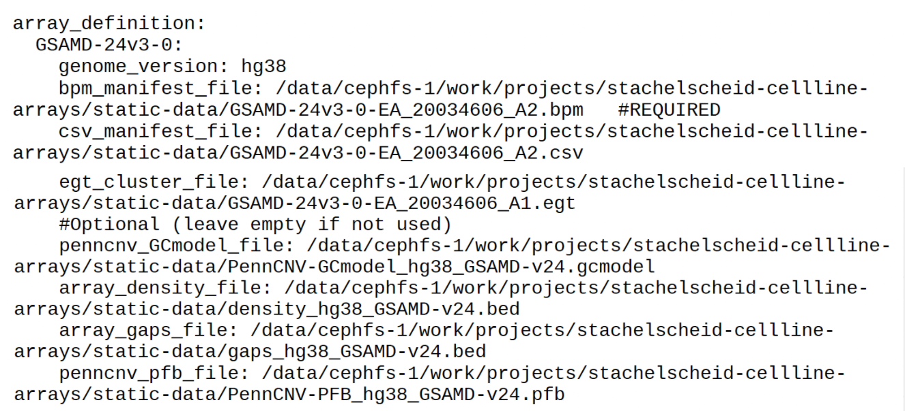

Config file options
============

Setting analysis parameters or changing them requires editing the text in  generated default config file. Start by opening the config.yaml in text editor. Then type in or change the necessary parameters. 

The default config file (config.yaml) defines all settings for the analysis and inherits from the inbuilt default.

Adjust the config file so that all entries marked as ``“#REQUIRED”`` are filled in.

**Array_definition**

Multiple arrays can be defined here, but arrays defined in global config saved in the cache are also available. The config file will take precedence over the global config, unless the file names here can not be used. Each array needs all required entries, but the `stemcnv-check make-staticdata` command will generate files marked as auto-generatable. By default both the files and an update to a global array definition file will be written into the cache directory (unless --no-cache is used). By default this file is at  ~/.cache/stemcnv-check/global_array_definitions.yaml

Once the array definitions are in the global file, you need to either delete the 'array_definition' block here or also update it with the information written out by `stemcnv-check make-staticdata` (which is the same as the entry written into the global array definition config), since this config takes precedence over the global file.

If no global config was used during the `make-staticdata` run, i.e. due to the --no-cache flag the array definitions will instead be written to a local file, i.e. 'ExampleArray_config.yaml' in the current working directory. In this case you will need to copy the contents of that file into this one, or alternatively into a global array definition file, that can still be created.

The config file (default: config.yaml) defines all settings for the analysis and inherits from the inbuilt default, as 
well as system-wide array definitions if those exist. While most of the settings can be left on default, the input files 
need to be defined. The file paths for these files need to be entered in the config under the 'array_definition' section. In this section 
you also need to give your array a name (that needs to match the 'Array_Name' column in the sample table) and define a 
genome version (hg19 or hg38). Please note that the Illumina bpm and csv manifest files are also specific to a certain 
genome version, usually files for hg19 end in 'A1' and those for hg38 end in 'A2' (the egt cluster file is not specific 
and can be used for any genome version).  
Other array specific files mentioned in the config can be auto-generated (see next step below).

- 'ExampleArray' should to be renamed to the actual array name

- **genome_version options:** hg38/GRCh38 or hg19/GRCh37

- **egt_cluster_file**: the illumina cluster file (.egt) for the array platform, available from Illumina or the provider running the array

- **bpm_manifest_file**: the beadpool manifest file (.bpm) for the array platform, available from Illumina or the provider running the array
- **csv_manifest_file** (optional): the manifest file in csv format, available from Illumina or the provider running the array

- **raw_data_folder**: input folder, path to the input directory under which the raw data (.idat) can be found. Ths folder should contain subfolders that match the Chip_Name column in the sample table (containing the array chip IDs). 
**idat files should be grouped in a subfolder per array-chip (sentrix_name)**

- **data_path**: the output of StemCNV-check will be written to this path
- **log_path**:  output folder, stemcnv-check will write log filesthe log files of StemCNV-check to this path

**Labelling system**

**Specification of labels (and their report colors) assigned to sample level QC measures**
sample_labels:
    OK: green
    unusual: yellow
    warning: orange
    high concern: red

# Default labels for CNVs (more can be added by users)
CNV_labels:
    # This is used to count critical CNVs & LOHs
    - Critical de-novo
    # This is used to count reportable CNVs & LOHs
    - Reportable de-novo
    - de-novo call
    - Reference genotype
    - Excluded call

# possible labels for SNVs
SNV_labels:
    - critical
    - reportable
    - unreliable impact
    - de-novo SNV
    - reference genotype

**Label for CNVs merged from multiple callers**

combined_cnvs: 'combined-call'

**The following lists are primarily used by the check_config functions**

Possible/Defined FILTERs applied to CNV calls (vcf style)

vcf_filters:
    - probe_gap
    - high_probe_dens 
    - min_size 
    - min_probes
    - min_density

**Possible/Defined categories for SNVs, each category can be assigned critical or reportable**
SNV_category_labels:
    - ROI-overlap
    - hotspot-match
    - hotspot-gene
    - protein-ablation
    - protein-changing
    - other

**Possible/Defined QC measures on sample level**
sample_qc_measures:
    - call_rate
    - computed_gender
    - SNPs_post_filter
    - SNP_pairwise_distance_to_reference
    - loss_gain_log2ratio
    - total_calls_CNV
    - total_calls_LOH
    - reportable_calls_CNV
    - reportable_calls_LOH
    - reportable_SNVs
    - critical_calls_CNV
    - critical_calls_LOH
    - critical_SNVs
  
**Possible/Defined report sections**
report_sections:
  - sample.information
  - QC.summary
  - QC.GenCall
  - QC.PennCNV
  - QC.CBS
  - QC.settings
  - SNV.table
  - SNV.hotspot.coverage
  - SNV.QC.details
  - denovo_calls.table
  - denovo_calls.plots
  - reference_gt_calls.table
  - reference_gt_calls.plots
  - regions.of.interest
  - SNP.dendrogram
  - genome.overview

**Possible/Defined subsections in the CNV plot sections**
report_plotsections:
  - denovo
  - reference_gt
  - regions_of_interest

Sample table 
============

Required Columns are: Sample_ID, Chip_Name, Chip_Pos, Array_Name, Sex, Reference_Sample, Regions_of_Interest, Sample_Group
Any number of additional columns can be added to the sample table as well, unless referred to in the config they will be ignored.
Specific explanations for columns:
 - Sample_ID:
       The folder and samples names for samples are derived from this entry. All entries *must* be unique. 
       To prevent issues with filenames only alphanumeric characters (all letters and number) and the characters -_
       (dash and underscore) are allowed.
 - Chip_Name and Chip_Pos:
       These entries must match the Sentrix name (usually a 12 digit number) and position (usually R..C..) on the Illumina array
 - Array_Name
       The name of the array used for the sample. This needs to match one of the arrays defined in the config under `array_definition`
 - Sex
       The sex of the sample is needed for analysis and mandatory. Allowed: f[emale]/m[ale] (not case sensitive)
 - Reference_Sample
       This column should refer to the (exact) Sample_ID of reference sample (i.e. a parental fibroblast line or master bank)
      If there is no usable or applicable reference sample the entry should be empty
 - Regions_of_Interest
       Definition of regions for which plots are always generated in the report (i.e. gene edited sites)
       The syntax for regions of interest is `NAME|region`, the `NAME|` part is optional and mainly useful for 
       labeling or describing the region.
       The `{region}` part is mandatory and can be one of the following:
       1) Position, "chrN:start-end": `chrN` can be i.e. 'chr3' or just '3',
          start and end are coordinates (which are genome build specific!)
       2) Genomic band, i.e. "4q21.3": a cytogenetic band, both full bands (q21) and subbands (q21.3) are allowed
       3) Gene symbol, i.e. "TP53": The gene name (or symbol) needs to exactly match the reference annotation (UCSC gtf)
       Multiple regions for a single sample should all be in one column entry and be separated by a `;`
 - Sample_Group
       This column can be used for annotation samples is used by default to select samples for clustering by SNPs.  

