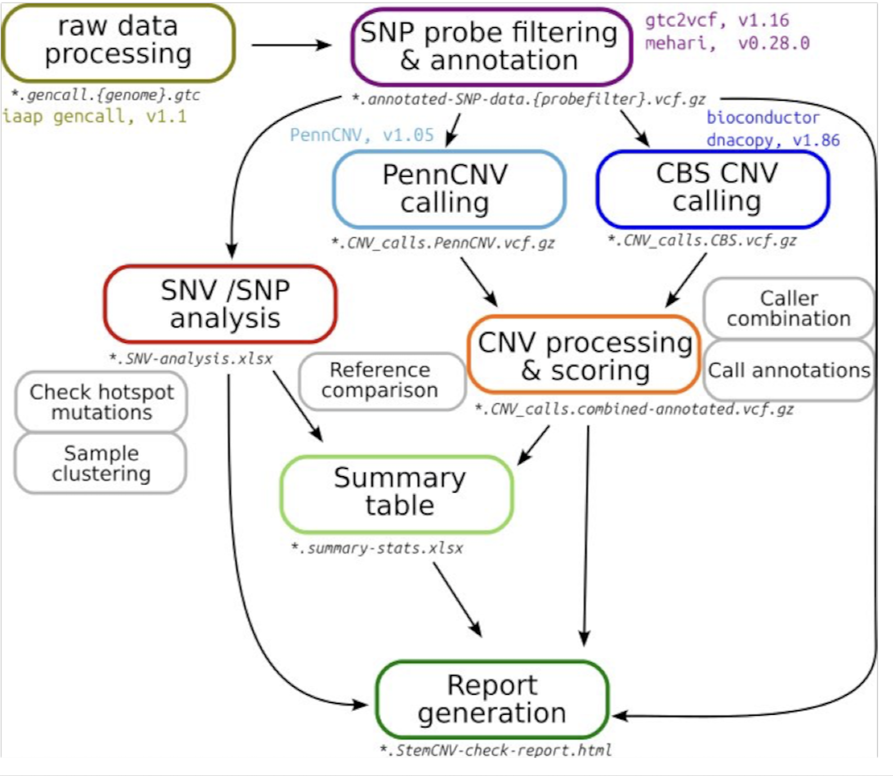

.. stemCNV-check documentation master file, created by
   sphinx-quickstart on Mon Apr 14 21:18:34 2025.
   You can adapt this file completely to your liking, but it should at least
   contain the root `toctree` directive.

stemCNV-check Manual
===========================

StemCNV-check is a tool written to simplify copy number variation (CNV) analysis of SNP array data, specifically for quality control of (pluripotent) stem cell lines. StemCNV-check uses snakemake to run the complete analysis from raw data (.idat) up report generation for all defined samples with a single command. Samples need to be defined in a (tabular) sample table and the workflow settings are defined through a yaml file.

**StemCNV-check provides:**

• Automated CNV calling
• Improved quality of calls over other tools
• CNV highlighting by Check-Score
• Easily readable report in html format
• Richly annotated CNV calls
• Comparison of cell line genotype identities

**stemCNV-check applications include:**

- Quality control of hPSC genetic integrity based on CNV detection in SNP-array data 
- Detection of loss of heterozygosity
- Detection of CNVs/SNPsresponsible for changes in amino acid sequence
- Identification of hPSC line and detection of swaps or cross-contamination based on comparison to reference samples,  analysis based on samples SNP distance which indicates hPSC line identity. This allows sample identification and detection of swaps  or cross-contamination 

- Evaluation of SNPs in coding regions of interest, detect  on/off target genomic changes generated after genetic engineering procedures.

**Requirements:**

- linux environment (or WSL on windows) 
- working conda (or mamba) 

Workflow overview
---------

.. toctree::
    :maxdepth: 2
    :caption: Contents:

    installation
    setup_project
    trouble_shooting 
    output_files
    

